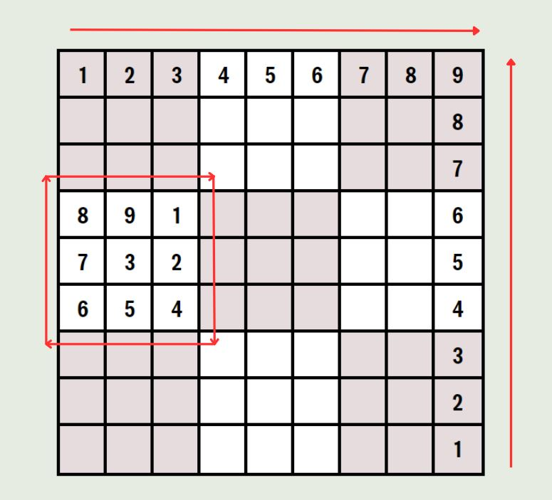

# Project One - Sudoku

## How To Play

Sudoku is made up of a **9x9 grid**. Within the grid, there are 9 squares made up of 3x3 spaces. 

Each row, column and square needs to be filled with numbers from 1-9, **without repeating any numbers**.

### Process of Elimination

Sudoku is a game of logic and reasoning, so guessing each number is not suggested. Use the process of elimination to determine each space. For example,

look at each of the number 9's. Each row, column and square they are in can immediately be ruled out as a potential space for 9, as there cannot be duplicates.

As you get further into the game and fill the spaces, you can begin to deduce which numbers will go where.

The example below shows the row highlighted has one empty space. As each number from 1-9 has been used except for 6, the final space must contain the 6.

In the square highlight in the example there are two empty spaces. Given the 2 reamining numbers not used in the square are 6 and 8, we can deduce they will go there. However, you will need to check the rest of the row and columns to see if either the 8 or 6 have been used somewhere.

## Give it a go!

Link for game here

## Attributions

https://developer.mozilla.org/en-US/ 

https://css-tricks.com/snippets/css/a-guide-to-flexbox/ 

https://www.geeksforgeeks.org/ 

## Built with

* Javascript
* HTML
* CSS

## Next Steps

